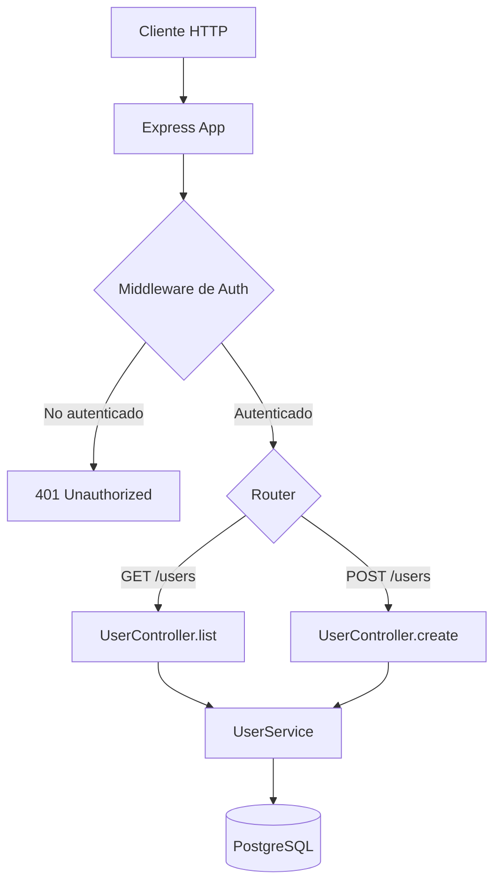

Hay un tipo de proyecto que todo desarrollador conoce: el que funciona, nadie lo entiende del todo, y la documentación consiste en un README de dos líneas que dice "ver código". A veces lo heredas de otro equipo. A veces eres tú mismo quien lo creó hace dos años y ya no recuerdas por qué hiciste las cosas así. En ambos casos, documentar ese proyecto es un trabajo que nadie quiere hacer, pero que todos necesitan.

Los LLMs han cambiado esta ecuación de forma notable. No porque documentar sea ahora divertido, sino porque el coste de generación se ha reducido drásticamente. En este artículo te explico cómo usar IA para convertir un proyecto sin documentar en algo que tu equipo del futuro te agradecerá.

## El problema de los proyectos sin documentar

Antes de hablar de soluciones, vale la pena entender exactamente qué daño hace la falta de documentación.

### El coste del onboarding

Cuando un nuevo desarrollador se incorpora a un proyecto sin documentar, necesita semanas para entender qué hace el sistema, cómo está organizado, y por qué se tomaron ciertas decisiones. Este tiempo es coste real: horas de un desarrollador senior explicando cosas que deberían estar escritas, bugs causados por malentendidos sobre cómo funciona algo, y decisiones de diseño que se repiten porque no quedó registro de por qué se eligió una alternativa.

### El coste del mantenimiento

Cuando algo falla en producción a las 3 de la mañana, y la persona que lo arregla no entiende el código, el problema se soluciona de la forma más rápida posible, no de la forma correcta. Esto acumula deuda técnica.

### El coste psicológico

El código sin documentar genera incertidumbre. Nadie quiere tocar un módulo que no entiende. Esto crea zonas del proyecto que se vuelven "sagradas" porque todos tienen miedo de romperlas.

## Cómo usar LLMs para generar documentación

La clave para documentar con IA es ser estratégico: no intentes documentar todo de una vez. Prioriza los módulos más críticos y más desconocidos, y avanza incrementalmente.

### Generación de READMEs

El README es lo primero que ve cualquier persona que llega a tu proyecto. Un buen README responde a: ¿qué hace este proyecto?, ¿cómo lo instalo?, ¿cómo lo uso?, ¿cómo contribuyo?.

Le puedes pedir a la IA que genere el README si le das el contexto adecuado:

```
Analiza la siguiente información sobre el proyecto y genera un README.md profesional.

Proyecto: [nombre]
Descripción breve: [qué hace]
Stack técnico: [lista de tecnologías]
Estructura de archivos: [muestra la estructura del directorio]
Scripts en package.json: [copia el contenido]
Archivo de configuración principal: [muestra el archivo]

El README debe incluir:
1. Descripción clara en 2-3 oraciones
2. Requisitos previos (versiones de Node, dependencias del sistema, etc.)
3. Instalación paso a paso
4. Cómo ejecutar en desarrollo
5. Cómo ejecutar los tests
6. Estructura del proyecto explicada
7. Variables de entorno necesarias (si las hay)
8. Cómo hacer deploy (si es relevante)

Tono: técnico y directo. Sin marketing ni relleno.
```

### Generación de docstrings y JSDoc

Para funciones y clases sin documentar, el flujo es sencillo: le das el código y le pides que genere la documentación.

```
Genera documentación JSDoc para todas las funciones exportadas del siguiente archivo.
No documentes funciones privadas (prefijo _) salvo que su lógica no sea obvia.

Para cada función:
- @description: qué hace (no cómo lo hace)
- @param: cada parámetro con tipo TypeScript y descripción
- @returns: tipo y descripción del valor de retorno
- @throws: qué excepciones puede lanzar y cuándo
- @example: un ejemplo de uso real con datos realistas

Si la función tiene comportamientos no obvios o casos límite importantes, 
añade una nota en la descripción.

[código del archivo]
```

### Comentarios en código complejo

Para algoritmos o lógica de negocio difícil de entender:

```
El siguiente código tiene lógica compleja.
Añade comentarios que expliquen:
1. Cuál es el propósito general del bloque
2. Por qué se eligió este enfoque (si es no obvio)
3. Qué invariantes se mantienen
4. Qué casos límite maneja este código específicamente

No comentes lo que es obvio leyendo el código.
Comenta el "por qué", no el "qué".

[código complejo]
```

## Diagramas de arquitectura con Mermaid

Uno de los usos más poderosos de la IA para documentación es generar diagramas de arquitectura en formato Mermaid. Mermaid es un lenguaje de descripción de diagramas que se renderiza en markdown (GitHub, Notion, y muchos otros lo soportan nativamente).

### Diagrama de flujo de la aplicación

```
Analiza el siguiente código de enrutamiento y middleware y genera un diagrama Mermaid
que muestre el flujo de una petición HTTP a través del sistema.

Incluye:
- Punto de entrada (cliente)
- Middleware que se aplica
- Rutas y sus handlers
- Servicios que llama cada handler
- Base de datos o servicios externos

[código de rutas y middleware]
```

El resultado puede ser algo como:



### Diagrama de entidades y relaciones

```
Analiza los siguientes modelos/schemas y genera un diagrama Mermaid ER 
(Entity Relationship Diagram) que muestre las relaciones entre entidades.

[modelos de base de datos o schemas]
```

### Diagrama de dependencias de módulos

```
Analiza los imports del siguiente conjunto de archivos y genera un diagrama Mermaid
que muestre las dependencias entre módulos. Agrupa los módulos por capa (api, services, 
repositories, utils, etc.).

[lista de archivos con sus imports]
```

## Documentación de APIs

Si tu proyecto expone una API REST o GraphQL, la IA puede generar documentación estructurada a partir del código de los endpoints.

### Para APIs REST sin Swagger/OpenAPI

```
Analiza los siguientes endpoints de Express/Fastify y genera documentación en formato
OpenAPI 3.0 (YAML).

Para cada endpoint incluye:
- Método HTTP y ruta
- Descripción de qué hace
- Parámetros (path, query, body) con tipos y si son requeridos
- Respuestas posibles (200, 400, 401, 404, 500) con ejemplos de body
- Si requiere autenticación

[código de los endpoints]
```

### Para documentación en markdown

Si prefieres documentación en markdown en lugar de un spec formal:

```
Genera documentación de API en markdown para los siguientes endpoints.

Formato para cada endpoint:
### POST /api/users
**Descripción**: Crea un nuevo usuario en el sistema.

**Headers requeridos**:
- Authorization: Bearer {token}

**Body**:
| Campo | Tipo | Requerido | Descripción |
|-------|------|-----------|-------------|
| email | string | Sí | Email único del usuario |

**Respuestas**:
- 201: Usuario creado exitosamente
- 400: Datos de entrada inválidos
- 409: Email ya existe

**Ejemplo**:
[request y response de ejemplo]

[código de los endpoints]
```

## Cómo estructurar un buen CLAUDE.md / AGENTS.md

El `CLAUDE.md` (para Claude Code) o `AGENTS.md` (para otros agentes de IA) es quizás el documento más valioso que puedes crear para un proyecto. No solo documenta el proyecto para humanos; le dice a la IA cómo trabajar con él de forma efectiva.

### Estructura recomendada para CLAUDE.md

```markdown
# Nombre del Proyecto

## Descripción
Una o dos oraciones explicando qué hace el proyecto y para quién.

## Contexto de negocio
Por qué existe este proyecto. Qué problema resuelve. Quiénes son los usuarios.
Este contexto es crucial para que la IA tome decisiones coherentes con los objetivos del proyecto.

## Stack técnico
- **Runtime**: Node.js 20 / Python 3.11
- **Framework**: Express 4.x / FastAPI
- **Base de datos**: PostgreSQL 15 con Prisma ORM
- **Tests**: Vitest + @testing-library/vue
- **Deploy**: Docker + AWS ECS

## Estructura del proyecto
src/
  api/          - Endpoints REST organizados por recurso
  services/     - Lógica de negocio (sin dependencias de HTTP)
  repositories/ - Acceso a base de datos (solo Prisma, sin SQL directo)
  utils/        - Funciones de utilidad puras (sin efectos secundarios)
  types/        - Types TypeScript compartidos

## Convenciones importantes
- **Naming**: PascalCase para clases, camelCase para funciones y variables
- **Errores**: Usa AppError con código y mensaje, no lanzar Error genérico
- **Async**: Siempre async/await, nunca callbacks ni .then()
- **Types**: No usar `any`. Si necesitas un tipo flexible, usa `unknown` y valida
- **Imports**: Rutas absolutas desde src/ usando alias @/

## Lo que NO hacer
- No añadir lógica de negocio en los controllers (va en services)
- No hacer queries SQL directas (usa el ORM)
- No exponer campos de contraseña o tokens en las respuestas
- No usar var (solo const y let)
- No hacer commits directamente a main

## Comandos útiles
npm run dev        # Servidor de desarrollo con hot reload
npm run test       # Tests unitarios
npm run test:e2e   # Tests de integración (requiere DB)
npm run db:migrate # Ejecutar migraciones pendientes
npm run db:seed    # Poblar con datos de prueba

## Decisiones de diseño importantes
- **Por qué Prisma**: Elegimos Prisma sobre TypeORM por su type safety automática.
  Los schemas de Prisma son la fuente de verdad del modelo de datos.
- **Por qué no microservicios**: El proyecto empezó como monolito y el equipo es pequeño.
  La arquitectura en capas permite extraer servicios si es necesario.
- **Autenticación**: JWT stateless. Los refresh tokens se guardan en Redis.
  No usamos sesiones de servidor.

## Áreas de riesgo
- El módulo de pagos (src/services/payment.ts) usa una librería legacy que no tiene tipos.
  Tiene sus propios tests pero requiere revisión manual cuidadosa.
- Las funciones de cálculo de impuestos son complejas y específicas del dominio.
  Consultar siempre con el equipo de negocio antes de modificarlas.
```

La IA que genere esto para ti puede hacer una primera versión, pero necesitas completarla con el conocimiento que solo tú tienes: las decisiones de diseño, las áreas de riesgo, y el contexto de negocio.

```
Analiza el código de este proyecto y genera un CLAUDE.md que sirva de contexto
para un agente de IA que trabaje en el código.

Incluye lo que puedas inferir del código sobre:
1. Stack técnico (analiza package.json y archivos de config)
2. Estructura del proyecto y propósito de cada directorio
3. Patrones de código que se usan consistentemente
4. Convenciones de naming y estilo
5. Comandos disponibles (de package.json)

Marca con [COMPLETAR MANUALMENTE] los campos que requieren conocimiento del contexto
de negocio que no puedes inferir del código.

[package.json, archivos de configuración, estructura de directorios]
```

## Ejemplo real: documentando un proyecto legacy

Voy a mostrarte cómo abordé la documentación de un proyecto Node.js de dos años sin documentar.

### Paso 1: Auditoría inicial

Le pedí a Claude que analizara el proyecto y me diera un informe de qué había:

```
Analiza la siguiente estructura de proyecto Node.js y dame un informe de:
1. Qué tipo de aplicación es (API, CLI, worker, etc.)
2. Stack técnico principal
3. Puntos de entrada del código
4. Módulos principales y su propósito aparente
5. Qué está documentado y qué no
6. Prioridad de qué documentar primero (por impacto)
```

### Paso 2: Documentación por capas

Empecé por la capa más externa (API endpoints) y fui hacia el interior:

1. **README principal**: generado con IA, completado a mano con contexto de negocio
2. **Documentación de API**: generada automáticamente de los endpoints
3. **JSDoc en services**: la capa de lógica de negocio más importante
4. **Comentarios en código complejo**: algoritmos y reglas de negocio no obvios
5. **CLAUDE.md**: para que futuros agentes de IA entiendan el proyecto

### Paso 3: Diagramas

Generé tres diagramas:
- Flujo de autenticación (el más complejo y menos documentado)
- Diagrama ER de la base de datos
- Dependencias entre servicios

### Resultado

En dos días de trabajo (la mitad del tiempo del proceso habitual), el proyecto tenía:
- README completo con instrucciones de instalación y uso
- Documentación de los 23 endpoints de la API
- JSDoc en los 8 servicios principales
- 3 diagramas en el README
- CLAUDE.md para contexto de agentes de IA

El tiempo ahorrado frente a hacerlo manualmente fue estimativamente del 60-70%. El tiempo que no se ahorra es el que requiere conocimiento que solo tienes tú: el contexto de negocio, las decisiones de diseño y las advertencias sobre módulos riesgosos.

## Manteniendo la documentación actualizada

El problema eterno de la documentación es que se vuelve obsoleta. Con IA, puedes integrar la actualización de documentación en tu flujo de trabajo:

**Al hacer un PR con cambios significativos**, añade como parte del proceso:

```
Revisa este diff y actualiza la documentación afectada:
- JSDoc de las funciones modificadas
- README si cambió alguna API pública o proceso de instalación
- CLAUDE.md si cambiaron convenciones o estructura del proyecto

[diff]
```

**Como paso del CI/CD** (más avanzado), puedes ejecutar un script que detecte funciones sin JSDoc y falle el build, forzando la documentación antes del merge.

## Conclusión

Documentar proyectos legacy es uno de los trabajos más valiosos y menos glamurosos del desarrollo de software. La IA no lo hace perfectamente, pero reduce el tiempo y el esfuerzo hasta el punto donde ya no hay excusa para no hacerlo.

El workflow es claro: usa IA para generar los borradores de README, JSDoc, comentarios y diagramas; añade tú el contexto de negocio y las decisiones de diseño que la IA no puede inferir; y crea un CLAUDE.md que haga que los futuros agentes de IA (y desarrolladores humanos) entiendan el proyecto desde el primer día.

Empieza hoy. Elige el módulo más crítico y menos documentado de tu proyecto, y dedica dos horas a documentarlo con ayuda de IA. El equipo del futuro, que incluye a tu yo de dentro de seis meses, te lo agradecerá.
